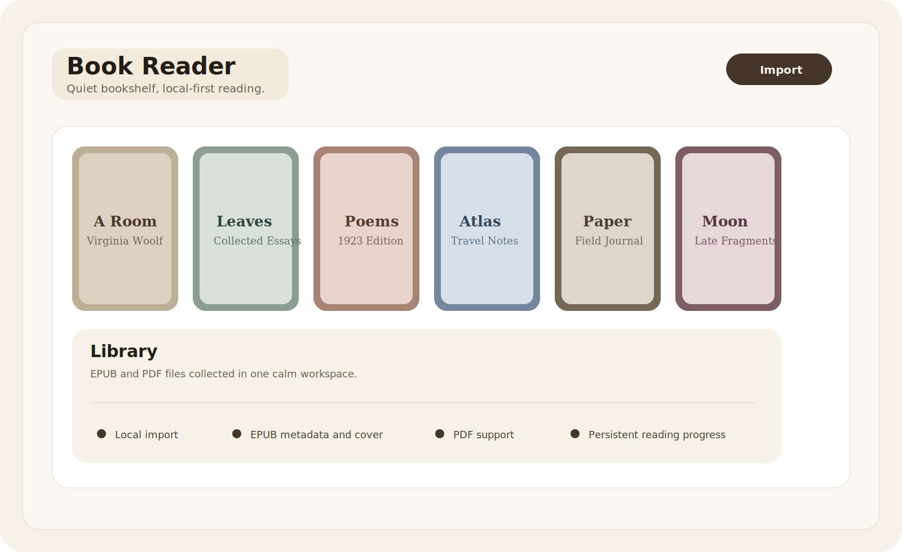

# Book Reader

一个简洁好用的本地电子书阅读器 - 支持 EPUB、PDF、TXT、MOBI

## 主要功能

- 支持 EPUB、PDF、TXT、MOBI 四种电子书格式
- 独立悬浮阅读窗口，可自由调整窗口大小
- 自动保存阅读进度，下次打开继续阅读
- 支持目录跳转、封面显示
- 支持自动滚动（看小说神器），速度可精细调节
- 字号调节、明暗主题切换
- 本地运行，无需联网，保护隐私

## 系统要求

- macOS 12.0 或更高版本
- Apple Silicon (M1/M2/M3) 或 Intel 处理器

## 安装使用

1. 下载 `.dmg` 安装文件
2. 拖动 Book Reader 到 Applications 文件夹
3. 双击打开，开始阅读

## 支持格式

| 格式 | 支持程度 |
|------|----------|
| EPUB | 完整支持（元数据、封面、目录、章节） |
| PDF | 基础支持（分页阅读、主题切换） |
| TXT | 完整支持（自动滚动、进度保存） |
| MOBI | 支持未加密文件（封面、目录、章节） |

**不支持**：DRM 保护的电子书、AZW/AZW3 格式

## 购买与下载

本软件为付费软件，购买后获取下载链接和使用说明。

- 个人使用授权：永久使用
- 免费更新同版本小版本
- 有问题可联系卖家

## 常见问题

**Q: 为什么打不开某些电子书？**
A: 受 DRM 保护的电子书无法打开，这是版权保护机制。

**Q: 阅读进度保存在哪里？**
A: 本地保存，卸载应用会丢失进度。

**Q: 可以安装在多台电脑上吗？**
A: 个人使用授权允许在同一用户名下的多台设备安装。

## 许可证

© 2026. All Rights Reserved. 本软件为商业软件，未经授权禁止复制、分发或用于商业用途。
