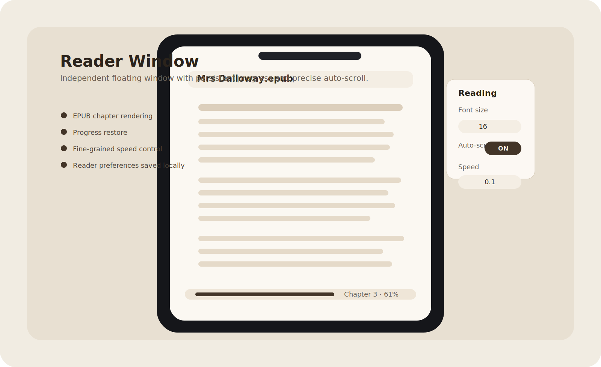

# Book Reader

[English](#english) | [中文](#中文)

A minimalist desktop reader for `EPUB` and `PDF`, built with Electron and React.

一个基于 Electron 和 React 的极简桌面阅读器，支持 `EPUB` 与 `PDF`。


## English

### Overview

Book Reader is a local-first desktop reading app focused on a clean bookshelf, a lightweight floating reader window, and persistent reading progress.

### Highlights

- Import local `EPUB` and `PDF` files
- Open books in an independent reader window
- Restore reading position and reading preferences locally
- Parse EPUB metadata, cover, table of contents, and chapters
- Support PDF page reading and progress restore
- Auto-scroll reading with fine-grained speed control down to `0.1`

### Preview

| Bookshelf | Reader |
| --- | --- |
|  |  |

These preview images are project showcase assets based on the current application UI and are intended for README and release presentation.

### Supported Formats

- `EPUB`: EPUB 2 / EPUB 3, metadata, table of contents, cover image, chapter rendering
- `PDF`: page reading, page switching, theme switching, progress restore

Not supported:

- `MOBI`
- `AZW / AZW3`
- DRM-protected ebook files

### Download

Local packaged build output:

- macOS Apple Silicon DMG: `dist/Book Reader-1.0.0-arm64.dmg`

For GitHub Releases, use the release body in `docs/release-v1.0.0.md` and attach the generated DMG from `dist/`.

### Getting Started

Install dependencies:

```bash
pnpm install
```

Run the Electron development environment:

```bash
npm run electron:start
```

`npm start` only launches the React development server and does not expose Electron APIs.

### Build

Build the frontend bundle:

```bash
npm run build
```

Package the desktop app for macOS:

```bash
npm run dist:mac
```

Pack without generating an installer:

```bash
npm run electron:pack
```

### Project Structure

```text
book/
├── docs/
│   ├── assets/
│   ├── first-release-process.md
│   └── release-v1.0.0.md
├── electron/
│   ├── main.js
│   └── preload.js
├── public/
│   ├── electron.json
│   └── index.html
├── src/
│   ├── components/
│   │   ├── BookCard.js
│   │   ├── Bookshelf.js
│   │   ├── PDFReader.js
│   │   └── Reader.js
│   ├── utils/
│   │   ├── EPUBParser.js
│   │   └── bookFormat.js
│   ├── App.js
│   ├── index.css
│   └── index.js
├── LICENSE
├── package.json
└── pnpm-lock.yaml
```

### Roadmap

- Real application screenshots captured from packaged builds
- App icon and release branding
- Better PDF controls such as jump-to-page and zoom
- Improved bookshelf organization and recent-reading entry points

### Release Notes

Draft release notes for the first public version are available in `docs/release-v1.0.0.md`.

### License

MIT

## 中文

### 项目简介

Book Reader 是一个本地优先的桌面阅读应用，重点在于干净的书架界面、轻量的悬浮阅读窗口，以及稳定的阅读进度保存。

### 主要特性

- 导入本地 `EPUB` 和 `PDF` 文件
- 在独立阅读窗口中打开书籍
- 本地保存阅读位置与阅读偏好
- 支持 EPUB 的元数据、封面、目录与章节解析
- 支持 PDF 的基础分页阅读与进度恢复
- 自动滚动速度支持更细颗粒控制，最低可到 `0.1`

### 效果展示

| 书架界面 | 阅读器界面 |
| --- | --- |
|  |  |

这两张图是按当前应用界面整理的项目展示素材，可直接用于 GitHub README 和 Release 页面。

### 支持格式

- `EPUB`：支持 EPUB 2 / EPUB 3、元数据、目录、封面和章节渲染
- `PDF`：支持基础分页阅读、翻页、主题切换和进度恢复

暂不支持：

- `MOBI`
- `AZW / AZW3`
- 受 DRM 保护的电子书文件

### 下载与打包

当前本地已打包产物：

- macOS Apple Silicon DMG：`dist/Book Reader-1.0.0-arm64.dmg`

发布 GitHub Release 时，可直接使用 `docs/release-v1.0.0.md` 里的文案，并上传 `dist/` 下生成的 DMG。

### 本地开发

安装依赖：

```bash
pnpm install
```

启动 Electron 开发环境：

```bash
npm run electron:start
```

`npm start` 只会启动 React 开发服务器，无法访问 Electron 的本地文件与窗口能力。

### 构建命令

构建前端资源：

```bash
npm run build
```

打包 macOS 应用：

```bash
npm run dist:mac
```

仅输出未封装安装器的应用目录：

```bash
npm run electron:pack
```

### 项目结构

```text
book/
├── docs/
│   ├── assets/
│   ├── first-release-process.md
│   └── release-v1.0.0.md
├── electron/
│   ├── main.js
│   └── preload.js
├── public/
│   ├── electron.json
│   └── index.html
├── src/
│   ├── components/
│   │   ├── BookCard.js
│   │   ├── Bookshelf.js
│   │   ├── PDFReader.js
│   │   └── Reader.js
│   ├── utils/
│   │   ├── EPUBParser.js
│   │   └── bookFormat.js
│   ├── App.js
│   ├── index.css
│   └── index.js
├── LICENSE
├── package.json
└── pnpm-lock.yaml
```

### 后续计划

- 补真实应用截图与发布页素材
- 补应用图标与品牌元素
- 增强 PDF 控件，例如跳页与缩放
- 改善书架组织方式与最近阅读入口

### Release 文案

首个公开版本的 GitHub Release 文案草稿见 `docs/release-v1.0.0.md`。

### 许可证

MIT
